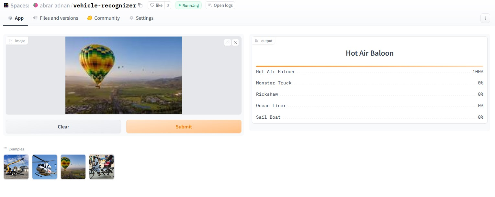
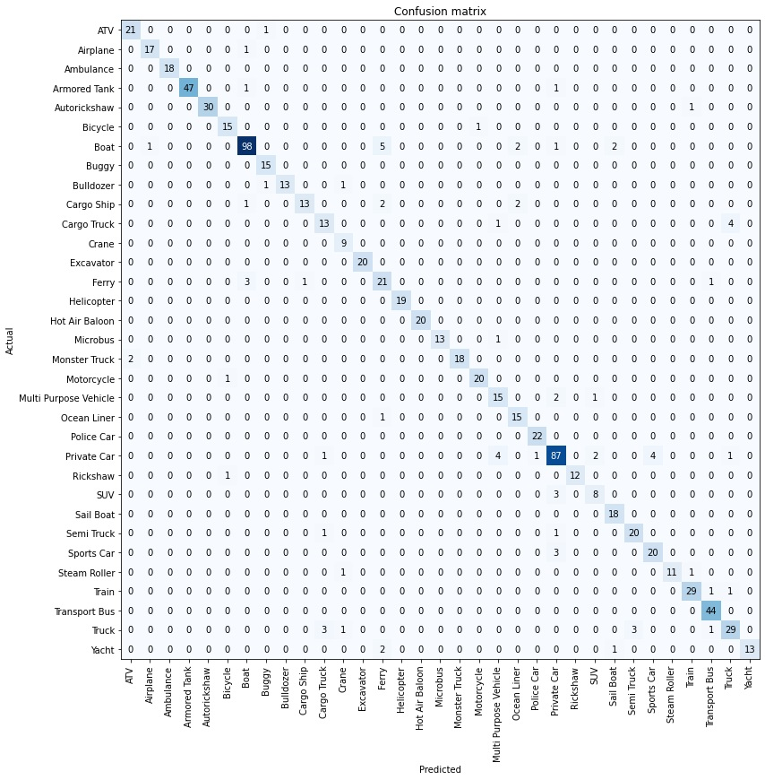

# Vehicle Image Recognizer

An image classification model that can classify 33 different types of vehicles, including:

1.   ATV
2.   Airplane
3.   Ambulance
4.   Armored Tank
5.   Autorickshaw
6.   Bicycle
7.   Boat
8.   Buggy
9.   Bulldozer
10.  Cargo Ship
11.  Cargo Truck
12.  Crane
13.  Excavator
14.  Ferry
15.  Helicopter
16.  Hot Air Baloon
17.  Microbus
18.  Monster Truck
19.  Motorcycle
20.  Multi Purpose Vehicle
21.  Ocean Liner
22.  Police Car
23.  Private Car
24.  Rickshaw
25.  SUV
26.  Sail Boat
27.  Semi Truck
28.  Sports Car
29.  Steam Roller
30.  Train
31.  Transport Bus
32.  Truck
33.  Yacht

This project covers all aspects of machine learning, including data collection, cleaning, model training, deployment, and API integration.
Dataset Preparation

    Data Collection: The dataset was downloaded from DuckDuckGo using exact term names 
    and related terms to gather a diverse set of images.
    
    DataLoader: The fastai DataBlock API was used to set up the DataLoader.
    
    Data Augmentation: fastai's default data augmentation, 
    which operates on the GPU, was used to enhance the dataset.
    
    More details can be found in the notebooks/data_prep.ipynb file.

Training and Data Cleaning

    Training: A resnet34 model was fine-tuned for 5 epochs and achieved an accuracy of ~90%.
    
    Data Cleaning: This step took the most time. Initially, there were more than 33 labels, 
    but they were merged to remove duplicates. Some labels therefore have more images than others. 
    The dataset was collected, arranged, and uploaded again for training.

Model Deployment

The model was deployed on the HuggingFace Spaces Gradio App. The implementation can be found in the deployment folder or [here](https://huggingface.co/spaces/abrar-adnan/vehicle-recognizer).

 

The confusion matrix of the model is also provided:

 

This model was used with the images found on duckduckgo. The images was focused on the vehicle heavily and there weren't much variables in terms of angle of the picture so if the pictures were taken from an unconventional angle the model would give less accurate results.

The deployed model API was integrated [here](https://abraradnan.github.io/vehicle-image-recognizer/) in GitHub Pages Website. The implementation and other details can be found in the docs folder.
